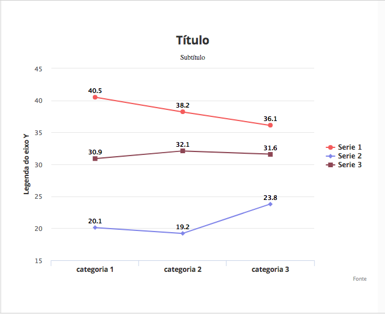

# Megadraft Backstage Chart - Megadraft Plugin


## Componente

Megadraft Backastage Chart é um componente CMA que desenha gráficos de
acordo com os dados fornecidos pelo usuário.

Utiliza-se da lib do Highcharts para renderizar os gráficos.

O componente conta com três opções de gráficos:

-  Linha
-  Barra
-  Pizza

## Exemplo do preview de um gráfico de linha gerado



>  A atualização desse preview ocorre imediatamente após qualquer alteração no
input dos dados do formulário.


## Instalando as dependências (npm)

```
make setup
```

## Rodando o dev-server

```
make run
open http://localhost:8080/demo
```

## Testando

Para rodar os testes + eslint

```
make test
```

Se você está constantemente rodando testes, existe uma alternativa mais rápida
utilizando watch:

```
make watch_unit
```
